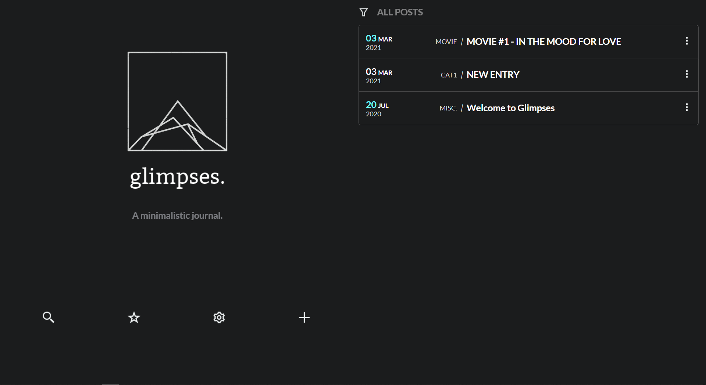

# Glimpses

A minimalistic journal app with Flask backend.





Glimpses provide a distraction free and focused writing experience along with categories and starring functionality for efficient organisation. WYSIWYG Editor embedded into Glimpses allow you to insert almost anything (HTML, Images, Links, Embedded Video, etc..). You can export the entries into pdf as well.

## Features
- Distraction Free Writing
- Minimalistic and Userfriendly UI
- WYSIWYG Editor
- Image upload
- Organize journals into categories
- Star favourite entries.
- Dark theme.
- Filter your journal entries
- Search through your journal


## Installation
- Clone the repository
```git
git clone https://github.com/safeers/Glimpses-journal.git
```
- Enter the glimpses directory
- Install requirements (You need python installed)
```bash
pip install -r requirements.txt
```
- Launch Glimpses (you can alternatively create a bash or bat(if you are on windows) to run following command)
```
python main.py
```

Enjoy Journalling...